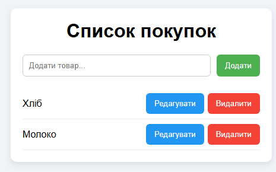

## 1. Планування
Мета: створити додаток **Список покупок**, який дозволяє користувачам зберігати та редагувати запис про покупу.

## 2. Аналіз вимог (User stories)
1. Як користувач, я хочу додавати новый продукт, щоб не забути. ✅ (Must have)
2. Як користувач, я хочу редагувати запис, щоб я купил правильний продукт. ✅ (Must have)
3. Як користувач, я хочу видаляти продукт який купив, щоб не оновлювати список або не купувати одне двічі. ✅ (Must have)
4. Як користувач, я хочу бачити список усіх покупок за весь час.
5. Як користувач, я хочу, щоб рахувалась загальна вартість.

## 3. Дизайн (Прототип)



## 4. Реалізація (Псевдокод)
```pseudo
function addNote(String text):
    if (text == ""):
        return "Error: Note cannot be null"
    else:
        note = createNote(text)
        notesList.add(note)
        return "Note added"
```  

## 5. Тестування
1. Додати запис “Купити хліб” → з’являється у списку.
2. Додати порожню задачу → система видає помилку.
3. Редагувати запис “КУпити хліб” на “Купити 2 хлібини” → запис змінює назву на відповідну.
4. Редагувати запис “КУпити хліб” на “” → повідомлення - “Пустий запис автоматично видаляється. Підтвердити редагнування?”, кнопки так або ні.
5. Видалити запис “Купити хліб” → зникає зі списку.

## 6. Висновки
Задача проста,але додатком будуть користуватися багато людей кожен день, тому треба додавати або змінювати функції “нальоту”.
Для цих цілей ідеальний **Agile-підхід** із короткими ітераціями.
Інші підходи не були б такими швидкими та ефективними.
